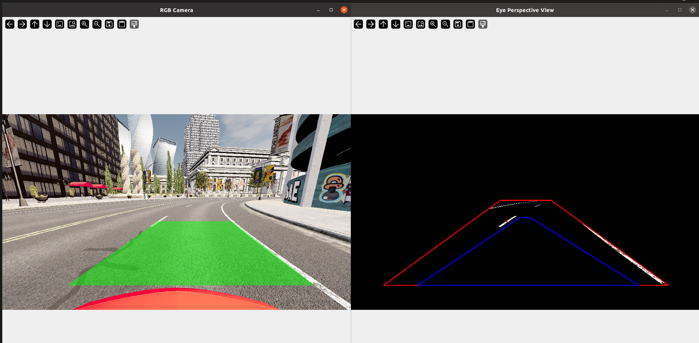

# Perception-algorithm
Perception algorithm for Lane Detection for master's thesis project

## Description of the project
This project was developed as a master's thesis in the Mechatronics Engineering program at the Polytechnic of Turin, during my internship at the Luxoft company.
The aim of the project is the recognition of road lanes in an urban environment in a simulated world thanks to CARLA.
The project was implemented in Python and uses the OpenCV library to manipulate images.

## Requirements
Before running the project, make sure you have the following requirements installed:
- Python 3.x (preferably 3.7)
- OpenCV
- CARLA
- NumPy

Other standard Python libraries:
  - `sys`
  - `random`
  - `time`
  - `tempfile`
  - `dataclasses`
  - `logging`

### System Requirements
The project must be run on a **Linux machine** with a **dedicated NVIDIA graphics card** to ensure optimal performance in running the CARLA simulator.


## Installation

### 1. Cloning the repository and submodule
First, clone this repository and make sure to include the `lux_ad_carla` repository as a **Git submodule**. The `lux_ad_carla` submodule contains additional assets and configurations required by CARLA.

To clone the repository with the submodule, use the following commands:

```bash
git clone https://github.com/NicMeri/perception-algorithm.git
cd perception-algorithm
git submodule init
git submodule update
```

This will initialize and clone the `lux_ad_carla` submodule in the correct directory.

### 1. Preparation of the environment
After cloning the repository, ensure that you have downloaded and installed CARLA correctly. You will need the lux_ad_carla submodule, which has been initialized in the previous step.

### 2. Configuring the virtual environment
Make sure you have: [Conda] [https://docs.conda.io/projects/conda/en/latest/user-guide/install/index.html] installed to create the virtual environment:
1. Create a new Conda environment and install Python 3.7:
   ```bash
   conda create -n carlaEnv python=3.7
   ```
2. Activate the environment:
   ```
   conda activate carlaEnv
   ```
3. Installing dependencies:
   ```
   pip install opencv-python numpy
   ```
4. Configuration of CARLA and Luxoft toolkit: Make sure you download the files required by CARLA and follow the instructions in the luxad_toolkit.sh file found in the repository. To activate the toolkit and correctly configure the CARLA environment, run the following commands:
   ```
   source luxad_toolkit.sh
   luxad_run_server
   luxad_run_client
   ```

The client performs road lane recognition in a simulated urban environment within CARLA.

## Project Structure
- `client.py`: Main script for lane recognition.
- `eye_perspective.py`: Submodule for managing the perspective view.
- `frame_threshold.py`: Submodule for image processing via thresholding.
- `luxad_toolkit.sh`: Script for configuring and running the server and client in CARLA.

## Additional notes
- This project requires CARLA version 0.9.15. Make sure you follow all installation instructions correctly.
- Linux with NVIDIA graphics card is required to optimize the performance of the CARLA simulator.

## Final Result
The project allows you to recognize road lanes in a simulated urban environment within CARLA. Below is a visual example of the result obtained.

### Output Examples


In the image, the system is able to correctly recognize the lanes of the road and display them both through the RGB view and through a specific perspective created to facilitate the interpretation of the road.

### Demo Video
If you want to see the system in action, you can watch the following video which shows the lane recognition process in real time:


## Authors
Niccolò Mariani

